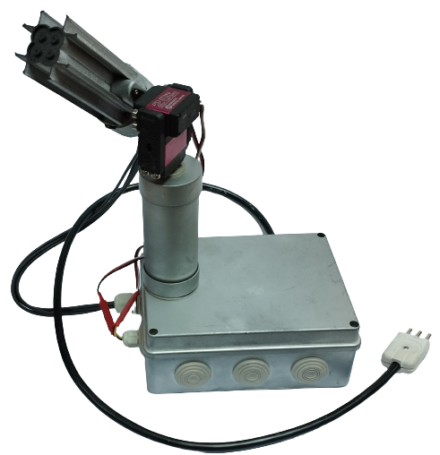

# Low-Cost Automatic Sun Photometer (LoCoASP)

A scale-oriented low-cost automatic sun photometer for distributed city-wide aerosol optical depth (AOD) measurements. It is currently in the fourth iteration of the instrument, and it will be deployed in different schools of Santiago City, Chile.



## Features

The following are some of the key features of the LoCoASP:

 * This instrument automatically tracks the sun and takes measurements in four different frequency bands.
 * It also measures the pressure, altitude, and temperature using the BMP180 sensor.
 * Each measurement has a timestamp and location obtained with a GPS receiver.
 * The photometer stores the data in a microSD card.
 * It measures every five minutes, and sleeps between measurements to save energy.

## Dependencies

The following are the current dependencies:

 * [SFE_BMP180](https://github.com/sparkfun/BMP180_Breakout_Arduino_Library).
 * [TinyGPSPlus](https://github.com/mikalhart/TinyGPSPlus).

## Cite our research

```
@article{garrido2021automated,
  title={Automated Low-Cost LED-Based Sun Photometer for City Scale Distributed Measurements},
  author={Garrido, Cristobal and Toledo, Felipe and Diaz, Marcos and Rondanelli, Roberto},
  journal={Remote Sensing},
  volume={13},
  number={22},
  pages={4585},
  year={2021},
  publisher={Multidisciplinary Digital Publishing Institute}
}

@article{toledo2018aot,
  title={AOT Retrieval Procedure for Distributed Measurements With Low-Cost Sun Photometers},
  author={Toledo, F and Garrido, C and D{\'\i}az, M and Rondanelli, R and Jorquera, S and Valdivieso, P},
  journal={Journal of Geophysical Research: Atmospheres},
  volume={123},
  number={2},
  pages={1113--1131},
  year={2018},
  publisher={Wiley Online Library}
}
```
